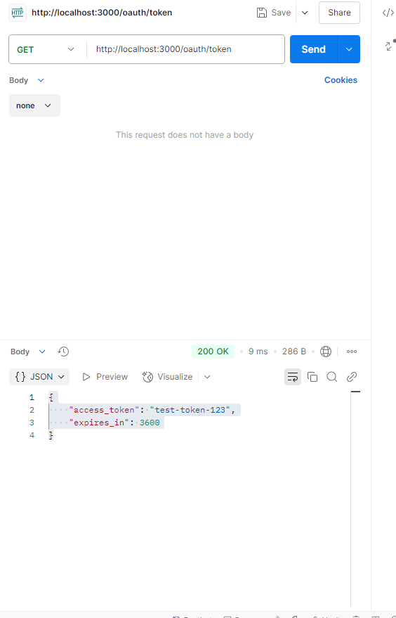
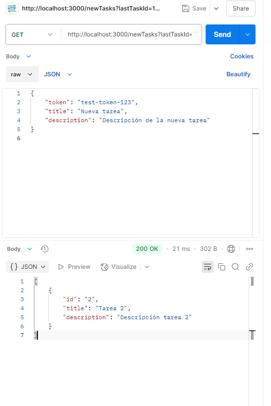

# TaskMaster API Integration

## Overview
This project implements a Zapier-like integration for the fictional app **TaskMaster**, featuring **OAuth 2.0 authentication** and a RESTful API for task management. It includes authentication, task creation, updates, rate limit handling, and webhook timeout prevention.

## Features
- **OAuth 2.0 Authentication**: Simulated token generation.
- **Triggers**:
  - "New Task Created" (polls for new tasks)
- **Actions**:
  - Create a new task
  - Update an existing task (includes retries and batch processing)
- **Rate Limit Handling**: Implements exponential backoff for `429 Too Many Requests` responses.
- **Webhook Timeout Handling**: Supports batch updates and retry mechanisms to prevent failures.

## API Endpoints
### 1. Authentication
| Method | Endpoint          | Description                         |
|--------|------------------|-------------------------------------|
| `POST` | `/oauth/token`   | Exchange authorization code for token |
| `GET`  | `/oauth/refresh` | Refresh access token               |

### 2. Task Management
| Method  | Endpoint        | Description                      |
|---------|----------------|----------------------------------|
| `GET`   | `/tasks`       | Retrieve all tasks              |
| `POST`  | `/tasks`       | Create a new task               |
| `PATCH` | `/tasks/{id}`  | Update an existing task         |
| `GET`   | `/tasks/{id}`  | Retrieve details of a task      |

### 3. Custom Endpoints for Testing
| Method  | Endpoint         | Description                                   |
|---------|-----------------|-----------------------------------------------|
| `GET`   | `/newTasks`      | Retrieve new tasks based on `lastTaskId`     |
| `POST`  | `/createTask`    | Create a task in TaskMaster                  |
| `POST`  | `/batchUpdate`   | Update multiple tasks using batch processing |
| `GET`   | `/diagnoseTimeout` | Diagnose possible webhook timeout causes |

## Setup & Execution
### Prerequisites
- **Node.js** installed
- **Postman** (optional for API testing)

### Installation
```sh
# Clone the repository
git clone https://github.com/your-username/taskmaster-integration.git
cd taskmaster-integration

# Install dependencies
npm install

# Start the server
npx ts-node src/server.ts
```
The server will run at `http://localhost:3000`.

## Postman API Tests
### 1. OAuth Token Generation
Successful token retrieval:


### 2. Fetching New Tasks
Testing the `/newTasks` endpoint:

## Handling Webhook Timeout Issues
### Possible Causes
- **Simultaneous updates** overloading the API
- **Slow API response times**
- **Lack of async processing or retries**

### Implemented Solutions
✅ **Batch Processing**: Updates tasks in small batches instead of sending all at once.  
✅ **Retry Mechanism**: Uses exponential backoff to retry failed updates.  
✅ **Improved API Handling**: Handles `429 Too Many Requests` errors gracefully.

## Suggested Improvements
1. **Asynchronous queues for bulk updates** (e.g., RabbitMQ, Kafka).
2. **Enhanced timeout monitoring** using logging and analytics.
3. **Dynamic batch size optimization** to improve API throughput.


## License
MIT License
